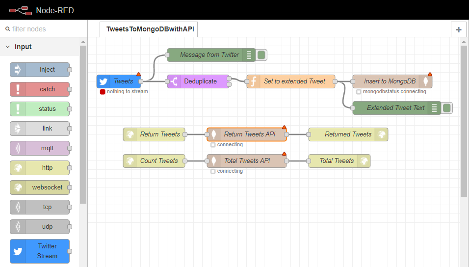

TweetsToMongoDBwithAPI
======================

### About

This flow provides an example of interacting with MongoDB by streaming Tweets in real-time and providing a RestAPI to query the database to return the tweets or provide a count of the total.

**Note:** In order to use the Twitter Stream Node the user will need to sign up for a Twitter developer account and set up a Twitter app. See [Twitter developer apps: Overview](https://developer.twitter.com/en/docs/basics/apps/overview). In order to use the MongoDB nodes you will need to have a MongoDB instance set up locally or in the cloud. See [MongoDB Guides: Install Mongo DB](https://docs.mongodb.com/guides/server/install/).
